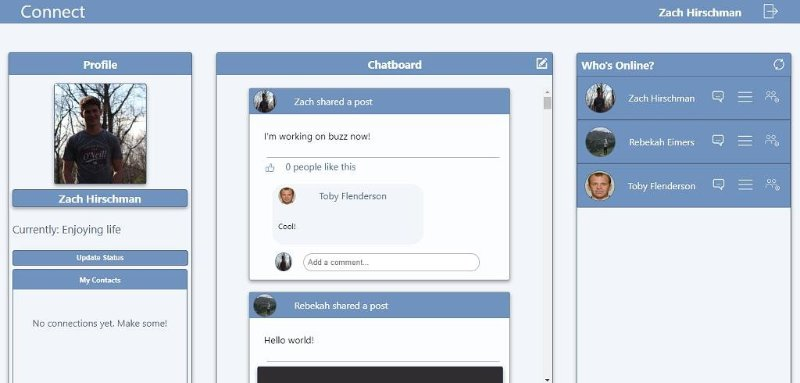

# Connect - DevMountain Personal Project

## connect is a social media application that allows users to chat with eachother directly in real time using Socket.io , React.js , Redux, Node.js, and Express.

### Login view

### Dashboard view

### this project was made over the course of two weeks and taught me a great deal about server - client relationships, as well as front end design. 